# Taller 2 — Docker + Nginx (Backend)

**Grupo 6** — Programación Backend, Universidad del Norte

## 1. Descripción de la solución

API REST de productos desarrollada con **Node.js, Express y TypeScript**, ejecutada dentro de un contenedor Docker. **Nginx** actúa como *reverse proxy* y es el único punto de entrada público (`localhost:8080`). La API no es accesible directamente desde el host; solo Nginx puede comunicarse con ella a través de la red interna de Docker. Como reto adicional se agregó un servicio **Redis**, accesible por su nombre DNS dentro de la misma red.

### Endpoints

| Método | Endpoint | Respuesta |
|---|---|---|
| GET | `/` | Información de la API |
| GET | `/health` | Estado del servicio (`{"status":"ok","service":"backend-api"}`) |
| GET | `/api/products` | Lista de productos |
| GET | `/api/products/:id` | Producto específico (404 si no existe, 400 si el id no es numérico) |

El puerto **no está escrito en el código**: se lee de la variable de entorno `PORT`. Si no se define, la aplicación termina con un error.

## 2. Arquitectura implementada

```
Navegador / curl
       │
       │  http://localhost:8080      ← única entrada pública (ports: "8080:8080")
       ▼
┌──────────────────────────── red Docker "backend" (bridge) ────────────────────────────┐
│                                                                                       │
│   ┌─────────────┐   http://api:3000    ┌─────────────┐          ┌─────────────┐       │
│   │    nginx    │ ───────────────────► │     api     │          │    redis    │       │
│   │    :8080    │   (DNS de Docker)    │    :3000    │ ───────► │    :6379    │       │
│   └─────────────┘                      └─────────────┘  redis   └─────────────┘       │
│                                         expose: 3000            sin puertos publicados│
└───────────────────────────────────────────────────────────────────────────────────────┘
```

**Flujo de una petición:** el cliente hace `GET http://localhost:8080/health` → Docker reenvía el puerto 8080 del host al contenedor `nginx` → Nginx consulta al DNS interno de Docker la IP de `api` → reenvía la petición a `api:3000` por la red `backend` → la API responde → Nginx devuelve la respuesta al cliente.

### Estructura del proyecto

```
backend-uninorte-taller2/
├── src/
│   └── server.ts        # API en Express + TypeScript
├── nginx/
│   └── nginx.conf       # Configuración del reverse proxy
├── Dockerfile           # Imagen de la API
├── compose.yaml         # Servicios api, nginx y redis
├── .dockerignore
├── package.json
├── package-lock.json
├── tsconfig.json
└── README.md
```

### Archivos clave

**Dockerfile.** Primero se copian `package.json` y `package-lock.json` y se ejecuta `npm install`; después se copia el código. Así, la capa de dependencias queda en cache y no se reinstala cada vez que cambia el código. Luego se compila TypeScript a `dist/`, se eliminan las dependencias de desarrollo (`npm prune --omit=dev`) y el contenedor se ejecuta con el usuario sin privilegios `node` en lugar de `root`.

**compose.yaml.** Define tres servicios en la red `backend`:
- `api`: construida desde el Dockerfile, con `PORT=3000`, `expose: "3000"` (no publica puertos) y un *healthcheck* sobre `/health`.
- `nginx`: imagen `nginx:stable-alpine`, único servicio con `ports: "8080:8080"`. Arranca solo cuando `api` está *healthy* (`depends_on: condition: service_healthy`).
- `redis`: imagen `redis:7-alpine`, sin puertos publicados.

**nginx.conf.** Define un `upstream backend_api { server api:3000; }` y reenvía `/`, `/health` y `/api/` a ese upstream. Cualquier otra ruta responde con un 404 en JSON.

## 3. Instrucciones para ejecutar

Requisitos: Docker y Docker Compose.

```bash
git clone https://github.com/CaDelTo/backend-uninorte-taller2.git
cd backend-uninorte-taller2
docker compose up -d --build
```

Probar:

```bash
curl http://localhost:8080/
curl http://localhost:8080/health
curl http://localhost:8080/api/products
curl http://localhost:8080/api/products/1
```

Detener:

```bash
docker compose down
```

## 4. Comandos Docker utilizados

| Comando | Propósito |
|---|---|
| `docker build -t backend-api .` | Construir la imagen de la API |
| `docker run -d --name backend-api -p 3000:3000 -e PORT=3000 backend-api` | Ejecutar la API sola (Parte 2) |
| `docker ps` | Listar contenedores en ejecución |
| `docker logs backend-api` | Ver la salida del contenedor |
| `docker inspect backend-api` | Ver ID, imagen, puertos, variables, redes y estado |
| `docker compose up -d --build` | Construir y levantar todos los servicios en segundo plano |
| `docker compose down` | Detener y eliminar contenedores y la red del proyecto |
| `docker compose ps` | Estado de los servicios |
| `docker compose logs nginx` / `docker compose logs api` | Logs por servicio |
| `docker compose exec nginx wget -qO- http://api:3000/health` | Probar la conexión Nginx → API desde dentro de la red |
| `docker network ls` | Listar redes Docker |
| `docker network inspect taller-docker-nginx_backend` | Ver contenedores conectados a la red y sus IPs |
| `docker compose exec api nslookup redis` | Ver la resolución DNS del nombre `redis` |

## 5. `ports` vs `expose`

**`ports`** publica un puerto del contenedor en la máquina host con el formato `host:contenedor`. Es como abrir una puerta hacia el exterior, cualquiera que acceda a la máquina puede entrar por ese puerto.

**`expose`** solo declara que el contenedor escucha en un puerto para uso interno. No lo publica en el host, así que desde afuera no es accesible, pero los demás contenedores de la misma red Docker sí pueden usarlo. En la práctica funciona como documentación, porque la comunicación interna la permite la red compartida.

En nuestro caso, al quitar `ports: "3000:3000"` y dejar `expose: "3000"` en `api`, `localhost:3000` dejó de responder, mientras que Nginx siguió llegando a `api:3000`. Así, la única entrada pública quedó en `localhost:8080`.

### Puerto del contenedor vs puerto publicado (Parte 3)

El puerto del contenedor es el puerto donde la aplicación escucha dentro del contenedor, en este caso el 3000. El puerto publicado es el puerto de nuestra máquina que Docker conecta con el del contenedor, y es por el que entramos desde afuera. Con `-p 3000:3000` los dos son el 3000. Si usáramos `-p 8081:3000`, la app seguiría escuchando en el 3000 dentro del contenedor, pero desde nuestra máquina entraríamos por `localhost:8081`.

## 6. `localhost` vs nombre del servicio Docker

`localhost` no representa al contenedor `api` porque cada contenedor tiene su propio `localhost` y su propia IP. Dentro del contenedor `nginx`, `localhost` es el mismo contenedor de Nginx, no el de la API.

Con `docker network inspect` comprobamos que Nginx y la API tienen IPs distintas dentro de la red `backend`: `api` → `172.20.0.2` y `nginx` → `172.20.0.3`.

El nombre del servicio sí funciona porque Docker Compose crea una red y un DNS interno que traduce el nombre del servicio a la IP del contenedor dentro de esa red. Por eso `http://api:3000` funciona entre contenedores y `http://localhost:3000` no.

## 7. Evidencias de las pruebas

### Parte 3: análisis del contenedor

`docker logs backend-api`:

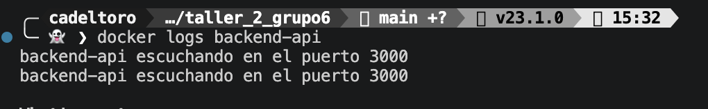

`docker inspect backend-api`:

| Dato | Valor |
|---|---|
| ID del contenedor | `5f0d39e3c0bd830ba62ed649983cb2dc4d0ff28dfe00ba4e2f1dd389217a635b` |
| Imagen | `backend-api` |
| Puertos | `3000/tcp` → `HostIp 0.0.0.0`, `HostPort 3000` |
| Variables de entorno | `PORT=3000`, `PATH=...`, `NODE_VERSION=24.21.0`, `YARN_VERSION=1.22.22` |
| Redes | `bridge`, IP `172.17.0.2` |
| Estado | Running |

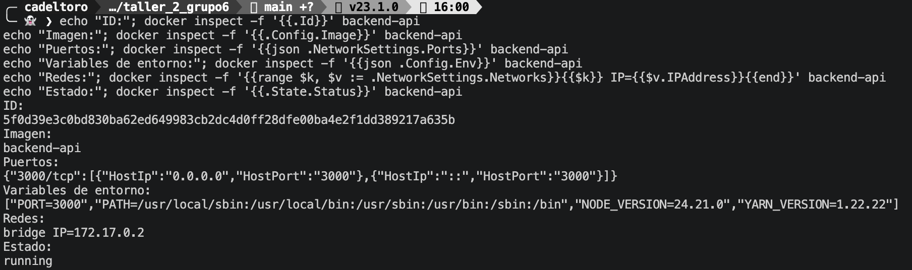

### Parte 7: eliminar el acceso directo al backend

`localhost:3000` ya no responde, `localhost:8080` sí, y desde el contenedor de Nginx se sigue llegando a `api:3000`:

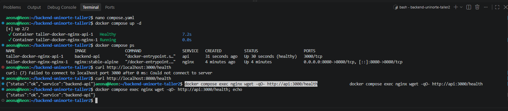

### Parte 8: pruebas

`curl` a los endpoints a través de Nginx y `docker compose ps`:

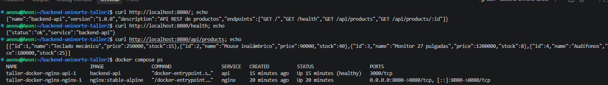

`docker compose logs nginx` y `docker compose logs api`:

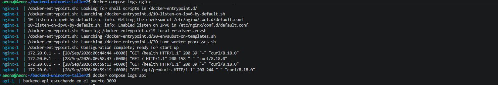

### Parte 9: diagnóstico de errores

Ver la sección 8.

### Parte 10: Redis

Ver la sección 9.

## 8. Troubleshooting: error con `localhost`

Se cambió temporalmente `server api:3000;` por `server localhost:3000;` en `nginx/nginx.conf` y se ejecutó:

```bash
docker compose down
docker compose up -d
curl -i http://localhost:8080/health
```

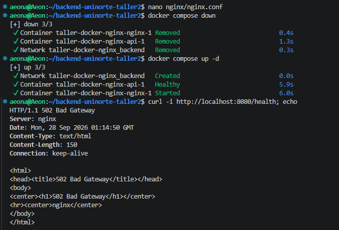

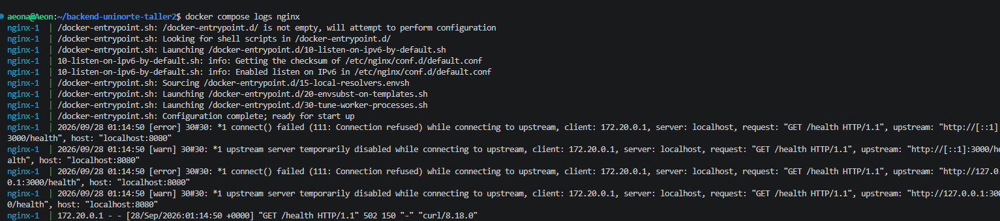

**¿Qué error obtiene? ¿Por qué ocurre?**
El error que arroja es **502 Bad Gateway**. Esto pasa porque Nginx recibió la petición, pero no obtuvo respuesta del servidor al que tiene que redirigirla. En este caso intenta redirigirla a `localhost`, que dentro del contenedor Nginx es él mismo, y ahí no hay ningún proceso escuchando en el 3000: Nginx solamente escucha en el 8080. La API está en otro contenedor aparte. En los logs se ve `connect() failed (111: Connection refused) while connecting to upstream`, con upstream `http://127.0.0.1:3000/health` (y `[::1]:3000` en IPv6).

**¿Por qué `localhost` no representa al contenedor `api`? ¿Qué comando verifica las redes Docker?**
`localhost` no representa al contenedor API porque cada contenedor tiene su propio `localhost` y su propia IP. Con `docker network ls` vemos las redes, y con `docker network inspect taller-docker-nginx_backend` vemos qué contenedores están conectados y sus IPs. Este último comando refuerza la respuesta anterior, porque muestra que Nginx y la API tienen IPs distintas.

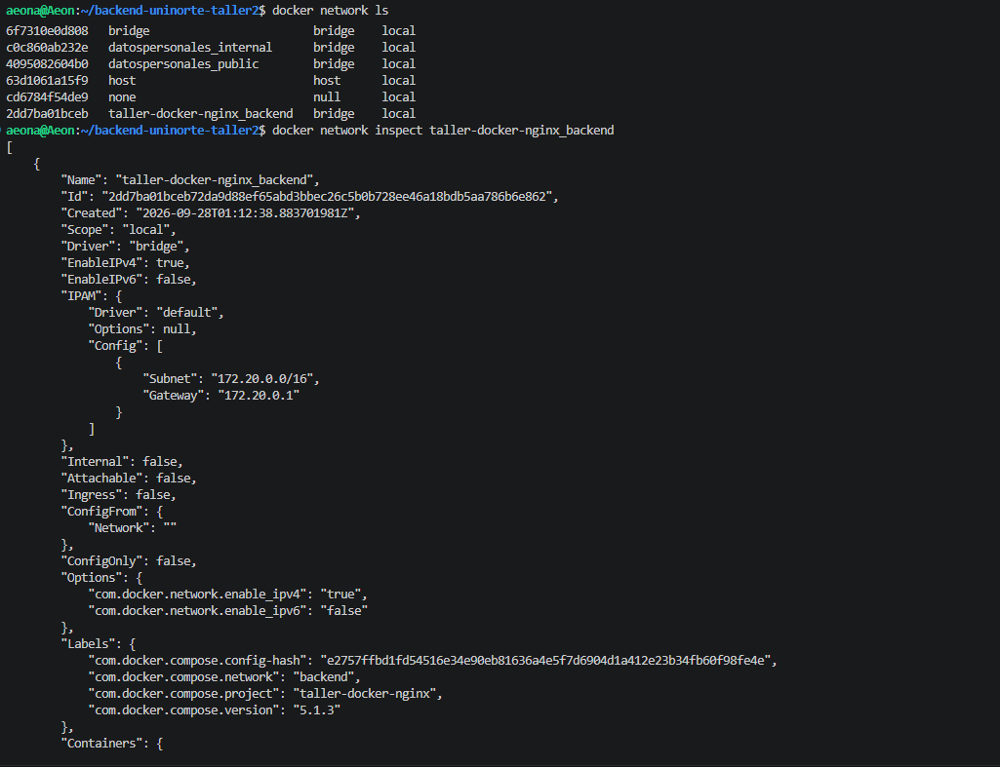

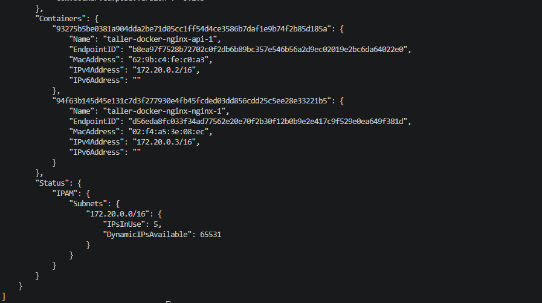

**¿Cómo se soluciona?**
Volviendo a `api:3000`. Funciona porque Docker Compose crea una red y un DNS interno que traduce el nombre del servicio a la IP del contenedor de la API dentro de esa red.

Revertimos el cambio:

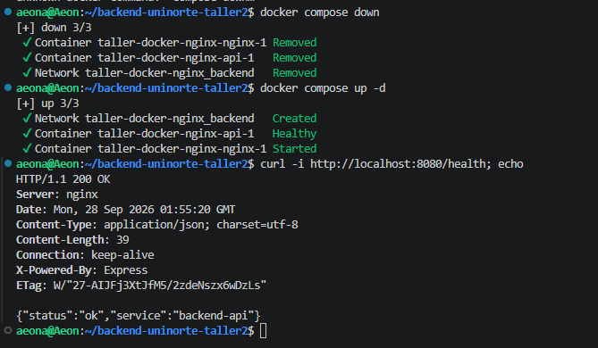

## 9. Reto adicional: Redis

Agregamos `redis` dentro de los servicios del `compose.yaml`, en la red `backend` y sin publicar puertos:

```yaml
  redis:
    image: redis:7-alpine
    networks:
      - backend
```

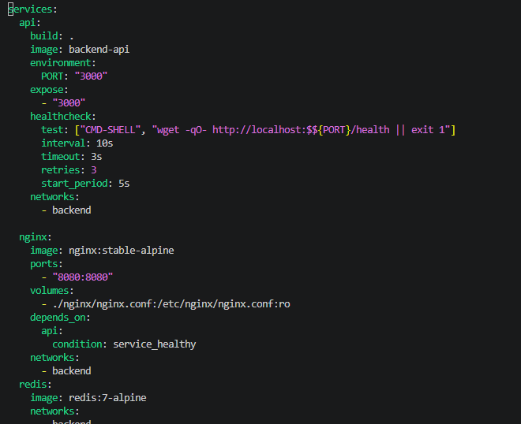

Servicio agregado:

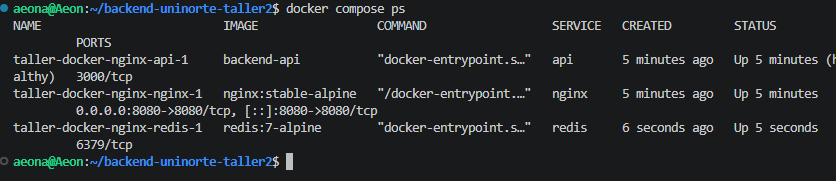

Desde el contenedor `api` abrimos una conexión al puerto 6379 y enviamos el comando `PING` a Redis:

```bash
docker compose exec api node -e "const s=require('net').connect(6379,'redis',()=>s.write('PING\r\n'));s.on('data',d=>{console.log(d.toString());process.exit()})"
```

Recibimos respuesta (`+PONG`) al hacer la conexión usando el nombre. Sin embargo, igual que antes, no funciona si usamos `localhost` (`ECONNREFUSED`):

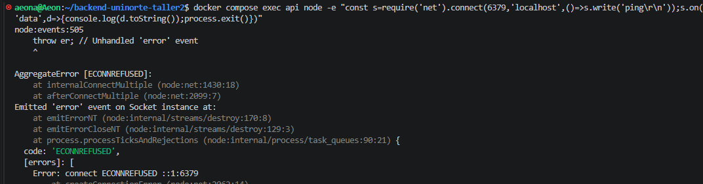

Aquí vemos a qué traduce `redis`: `172.20.0.4`. El servidor que responde es `127.0.0.11`, el DNS interno de Docker:

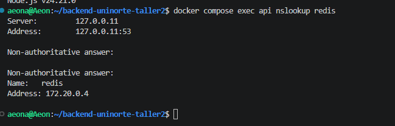
